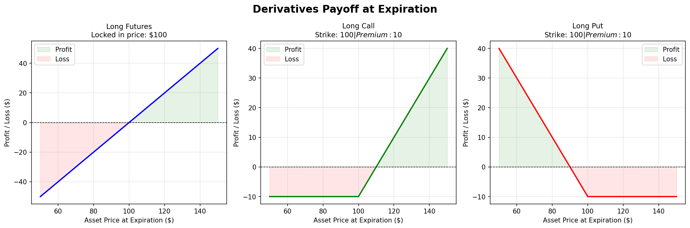

# Project 1 — Derivatives Payoff Visualizer

Visualizes the profit/loss at expiration for three fundamental derivative instruments: futures contracts, call options, and put options. Outputs side-by-side payoff diagrams with profit/loss shading.

---

## The Finance

### What is a derivative?

A derivative is a contract whose value is derived from an underlying asset (a stock, commodity, index, etc.). Rather than buying the asset directly, derivatives let you gain exposure to price movements — sometimes with a fraction of the capital, and sometimes with capped downside.

### The three instruments

**Futures contract**
A legally binding agreement to buy or sell an asset at a fixed price (F) on a future date. Both parties are obligated — there is no optionality. Profit is linear: every dollar the price rises above F is a dollar of gain for the buyer, and vice versa. Upside and downside are both unlimited.

```
Payoff = S − F
```

**Call option**
Gives the holder the right (not obligation) to **buy** the underlying at the strike price K. If the asset finishes above K, you exercise and profit from the difference. If it finishes below K, you walk away — your only loss is the premium paid upfront.

```
Payoff = max(S − K, 0) − premium
```

**Put option**
Gives the holder the right (not obligation) to **sell** the underlying at the strike price K. Profits when the asset falls below K. Maximum loss is capped at the premium paid.

```
Payoff = max(K − S, 0) − premium
```

### Why payoff diagrams?

Payoff diagrams are the visual language of derivatives trading. Every complex strategy — straddles, spreads, collars, condors — is just a superposition of these three basic shapes. Understanding them visually is the foundation for understanding anything more sophisticated.

| Instrument | Obligation | Max loss | Profits when |
|------------|-----------|----------|--------------|
| Futures | Must buy/sell at F | Unlimited | Price moves your way |
| Call | Right to buy at K | Premium paid | Price rises above K + premium |
| Put | Right to sell at K | Premium paid | Price falls below K − premium |

---

## How to Run

### Install dependencies

```bash
pip install -r requirements.txt
```

### Run the visualizer

```bash
python payoff_visualizer.py
```

Generates `payoff_diagrams.png` and displays the plot. Default parameters: futures price = $100, strike = $100, call premium = $10, put premium = $10.

### Output



---

*Reference: Hull, J.C. (2022). Options, Futures, and Other Derivatives (11th ed.). Pearson.*
